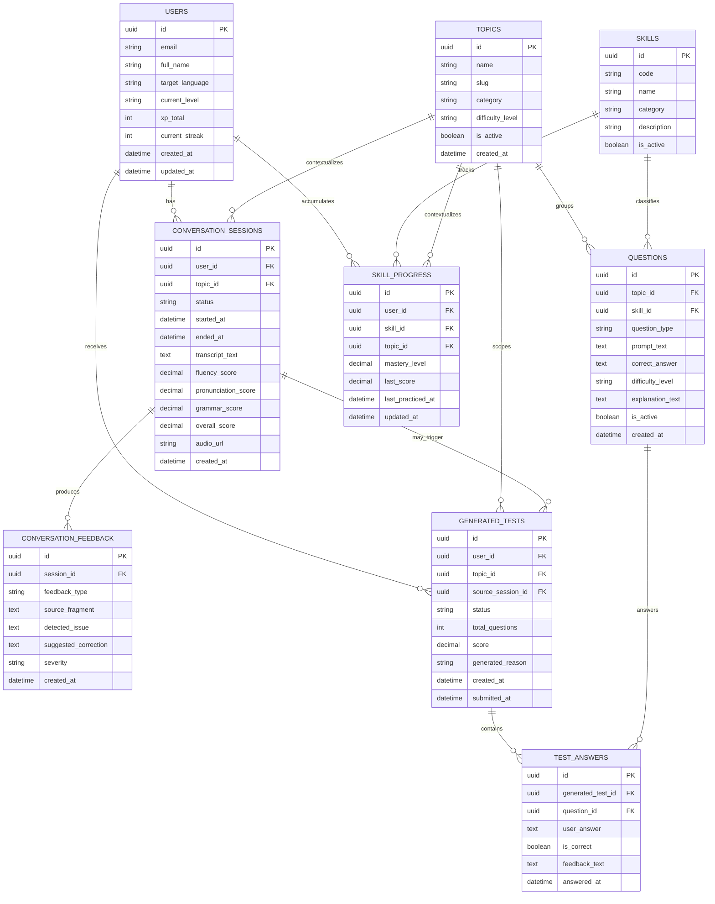

# Modelo Entidad-Relacion MVP: Play-Learn

Version: 1.0
Fecha: 2026-04-09
Estado: Modelo base para implementacion MVP

## 1. Objetivo del modelo
Este modelo entidad-relacion define la estructura minima necesaria para soportar el MVP de Play-Learn.

Cobertura del MVP:
1. Registro y perfil de usuario.
2. Seleccion de temas de conversacion.
3. Sesiones de conversacion con transcripcion y puntaje.
4. Feedback estructurado por sesion.
5. Banco de preguntas.
6. Tests generados dinamicamente.
7. Respuestas del usuario.
8. Seguimiento de progreso por habilidad y tema.

## 2. Alcance del MVP
Se excluye deliberadamente del modelo inicial:
1. Marketplace o monetizacion.
2. Social features complejas.
3. Ranking global avanzado.
4. Analitica historica pesada separada del core transaccional.

## 3. Entidades principales

### users
Descripcion: identidad y estado general del estudiante.

Campos clave:
1. id (PK)
2. email (UNIQUE)
3. full_name
4. target_language
5. current_level
6. xp_total
7. current_streak
8. created_at
9. updated_at

### topics
Descripcion: escenarios o mundos de practica.

Campos clave:
1. id (PK)
2. name
3. slug (UNIQUE)
4. category
5. difficulty_level
6. is_active
7. created_at

### conversation_sessions
Descripcion: cada practica conversacional del usuario.

Campos clave:
1. id (PK)
2. user_id (FK -> users.id)
3. topic_id (FK -> topics.id)
4. status
5. started_at
6. ended_at
7. transcript_text
8. fluency_score
9. pronunciation_score
10. grammar_score
11. overall_score
12. audio_url
13. created_at

### conversation_feedback
Descripcion: hallazgos y recomendaciones derivados de una sesion.

Campos clave:
1. id (PK)
2. session_id (FK -> conversation_sessions.id)
3. feedback_type
4. source_fragment
5. detected_issue
6. suggested_correction
7. severity
8. created_at

### skills
Descripcion: habilidades evaluables del sistema.

Campos clave:
1. id (PK)
2. code (UNIQUE)
3. name
4. category
5. description
6. is_active

### questions
Descripcion: banco de reactivos reutilizable.

Campos clave:
1. id (PK)
2. topic_id (FK -> topics.id)
3. skill_id (FK -> skills.id)
4. question_type
5. prompt_text
6. correct_answer
7. difficulty_level
8. explanation_text
9. is_active
10. created_at

### generated_tests
Descripcion: instancia de evaluacion creada para un usuario.

Campos clave:
1. id (PK)
2. user_id (FK -> users.id)
3. topic_id (FK -> topics.id, NULLABLE)
4. source_session_id (FK -> conversation_sessions.id, NULLABLE)
5. status
6. total_questions
7. score
8. generated_reason
9. created_at
10. submitted_at

### test_answers
Descripcion: respuestas individuales dentro de un test generado.

Campos clave:
1. id (PK)
2. generated_test_id (FK -> generated_tests.id)
3. question_id (FK -> questions.id)
4. user_answer
5. is_correct
6. feedback_text
7. answered_at

### skill_progress
Descripcion: estado adaptativo por usuario, habilidad y tema.

Campos clave:
1. id (PK)
2. user_id (FK -> users.id)
3. skill_id (FK -> skills.id)
4. topic_id (FK -> topics.id, NULLABLE)
5. mastery_level
6. last_score
7. last_practiced_at
8. updated_at

Restriccion recomendada:
1. UNIQUE (user_id, skill_id, topic_id)

## 4. Relaciones clave
1. Un user puede tener muchas conversation_sessions.
2. Un topic puede tener muchas conversation_sessions.
3. Una conversation_session puede tener muchos conversation_feedback.
4. Un topic puede tener muchas questions.
5. Una skill puede tener muchas questions.
6. Un user puede tener muchos generated_tests.
7. Un generated_test puede tener muchas test_answers.
8. Una question puede aparecer en muchas test_answers.
9. Un user puede tener muchos registros en skill_progress.
10. Una skill puede aparecer en muchos registros de skill_progress.
11. Un topic puede contextualizar muchos registros de skill_progress.
12. Una conversation_session puede originar cero o muchos generated_tests, aunque en MVP conviene permitir como maximo uno por flujo principal.

## 5. Reglas de negocio del MVP
1. Cada sesion de conversacion pertenece a un solo usuario y a un solo tema.
2. El feedback conversacional debe quedar desacoplado de la sesion para permitir multiples observaciones por turno o por error.
3. El progreso no debe calcularse solo por tests; tambien debe actualizarse desde resultados de conversacion.
4. Un test generado puede crearse por debilidad detectada en una sesion previa.
5. Las preguntas se etiquetan por topic y por skill para soportar adaptacion simple sin depender aun de IA compleja.

## 6. Decisiones criticas del modelo
1. No separar audio_chunks, turns o phoneme_events en MVP. Eso agrega complejidad antes de validar uso real.
2. transcript_text vive en conversation_sessions por simplicidad. Si luego se necesita granularidad por turno, se agrega conversation_turns.
3. conversation_feedback se modela como tabla propia para evitar guardar feedback en JSON inmanejable desde el inicio.
4. skill_progress es la pieza central del sistema adaptativo. Si esta tabla queda mal diseñada, el producto pierde personalizacion real.
5. generated_tests referencia opcionalmente a source_session_id para mantener trazabilidad pedagogica.

## 7. Diagrama ER en Mermaid

## 8. Secuencia de uso del modelo en el MVP
1. El usuario selecciona un topic.
2. Se crea conversation_session.
3. Se guarda transcript_text y scores base.
4. Se insertan varios conversation_feedback.
5. Se actualiza skill_progress usando hallazgos de la sesion.
6. Si corresponde, se crea generated_test.
7. El usuario responde y se guardan test_answers.
8. Se recalcula skill_progress.

## 9. Evolucion futura recomendada
Agregar solo cuando haya evidencia:
1. conversation_turns para granularidad por turno.
2. pronunciation_events para detalle fonetico.
3. achievements y user_achievements para gamificacion expandida.
4. learning_paths para rutas por carrera o necesidad.
5. audit_logs para trazabilidad ampliada.

## 10. Conclusion
Este ERD esta deliberadamente contenido. Tiene suficiente estructura para soportar personalizacion, trazabilidad y evaluacion adaptativa en el MVP sin caer en complejidad prematura.

La entidad mas importante no es sessions, sino skill_progress: ahi vive la inteligencia pedagogica real del producto.

## 11. Artefacto SQL
La implementacion base para PostgreSQL esta disponible en [play_learn_mvp_postgres.sql](play_learn_mvp_postgres.sql).